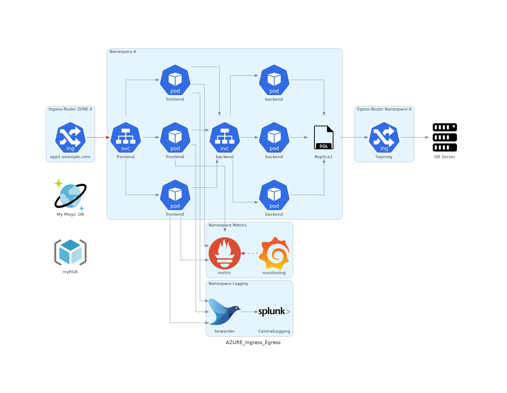
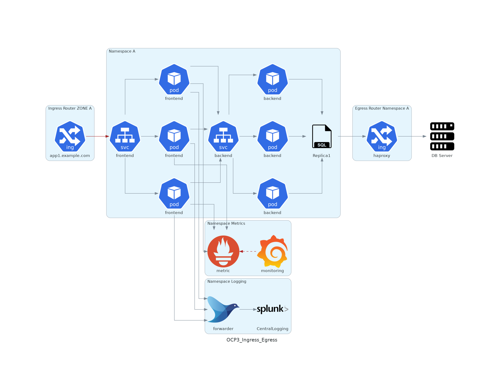

# Getting Started

# Diagram as Code

[diagrams](https://diagrams.mingrammer.com/)


## Example
```python
# diagram.py
from diagrams import Diagram
from diagrams.aws.compute import EC2
from diagrams.aws.database import RDS
from diagrams.aws.network import ELB

with Diagram("Web Service", show=False):
    ELB("lb") >> EC2("web") >> RDS("userdb")
```

## Azure Example Diagramms


//
 
