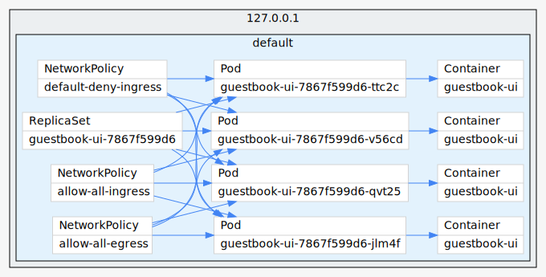

# kubectl graph

https://github.com/steveteuber/kubectl-graph/


```bash
./kubectl-graph deployments,replicasets,pods | dot -T svg -o pods.svg
./kubectl-graph networkpolicies | dot -T svg -o networkpolicies.svg


```

